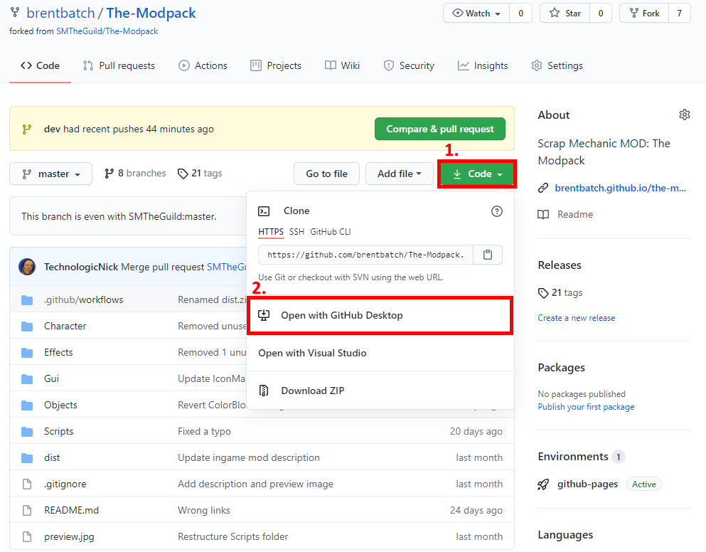
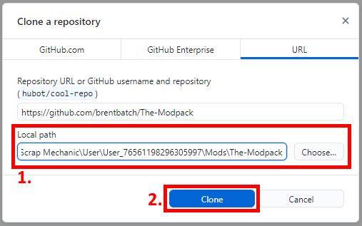
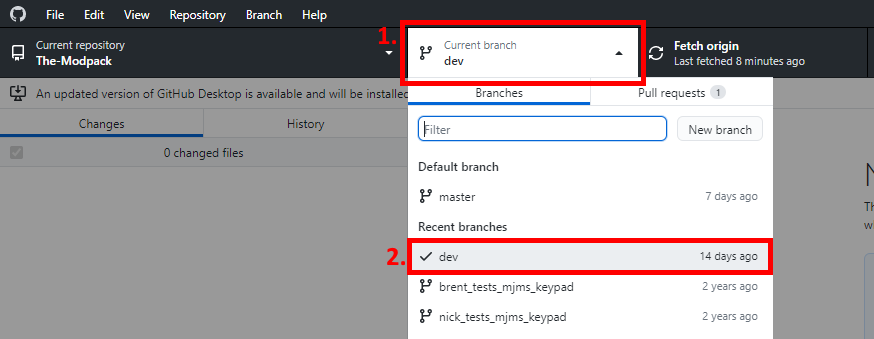
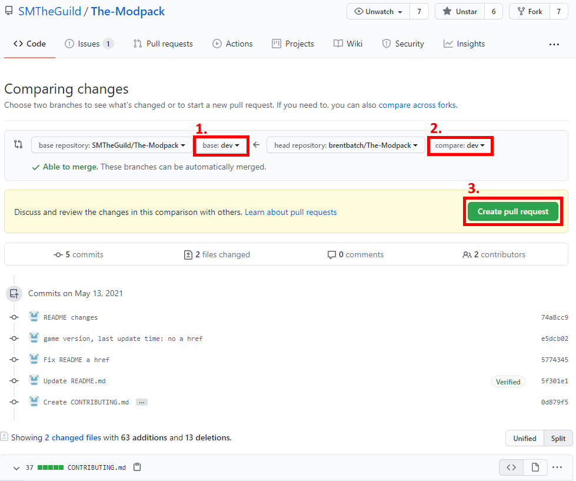

# Contribute to The Modpack

You can find more information about The Modpack [here](https://brentbatch.github.io/The-Modpack/).

## Index

* [Index](#Index)
* [How do I contribute](#How-do-I-contribute)
  * [Create issues](#Create-issues)
  * [Contribute code](#Contribute-code)
* [Coding guidelines](#Coding-guidelines)
  * [Naming convensions](#Naming-convensions)
  * [Folder structure](#Folder-structure)

## How do I contribute?

### Create issues

You can create issues [here](https://github.com/SMTheGuild/The-Modpack/issues).  
*What can you do there?*
- Report bugs.
- Request fixes.
- Request features.
- Ask questions.

Before you create a new issue, please do a search in open issues to see if the issue or feature request has already been filed.  
If you find your issue already exists, make relevant comments and add your reaction.  
Use a reaction in place of a "+1" comment:  
👍 - upvote  
👎 - downvote  
If you cannot find an existing issue that describes your bug or feature, create a new issue.  

### Contribute code

If you want to add features, fix bugs, or do any other changes. you can do so!  
Even contributing to this *contributing guidelines* file is possible!

  
<b>Contribution tutorial</b>

  
  1. Create or login to [Github](https://github.com/login).
  2. Download [Github Desktop](https://desktop.github.com/).
  3. Fork the ['The Modpack'](https://github.com/SMTheGuild/The-Modpack) repository.  
    
  4. Clone your forked repository.  
    A. Click the 'Code' button & 'Open with github desktop' button.  
        
    B. Click 'Open GitHubDesktop.exe'  
        
    C. Choose your mods folder and click 'clone'.  
      
  5. In Github Desktop, Select the 'dev' branch.  
    
  6. Create your local changes.  
    :warning: To test out your changes, copy the ``.../Mods/The-Modpack/dist/description.json`` and ``.../Mods/The-Modpack/dist/preview.jpg`` files to your ``.../Mods/The-Modpack/`` folder.
  7. Commit your changes in github desktop by providing a useful commit message, clicking 'Commit to dev' and then 'Fetch origin'/'Push origin' at the top.  
    
  8. If you are happy with your changes you can open a pull request.  
    A. Go to your forked repository page (example: https://github.com/brentbatch/The-Modpack/)  
    B. Open the tab 'pull requests'  
    C. Click 'new pull request'  
    D. Select the 'dev' branch for both repositories as shown below  
    E. Click 'Create pull request'  
    F. We'll take it from here! :)
      
    

## Coding guidelines

### Naming convensions

A Lua file should only define a **maximum** of **one class**. Classes should be named in PascalCase.  
If a Lua file defines a class, it should be named ``<ClassName>.lua``.

### Folder structure

**Folder names** inside ``Scripts/`` should be in lowercase.  
**Interactable class** files should be located in ``Scripts/interactable/``.  
**Tool class** files should be located in ``Scripts/tool/``.  
**Libraries and utility scripts** should be located in ``Scripts/libs/``.  
**Json data files** should be located in ``Scripts/data/`` and be named in underscore_case (e.g. shape_database.json).
